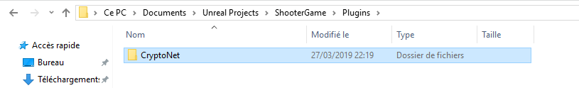

# CryptoNet documentation

Hello and thanks for downloading the CryptoNet plugin!

## Getting started

Here we’ll guide you on how to install CryptoNet to your project and make it work. I’ll use the ShooterGame as an example project for the tutorial.

### Installing CryptoNet

First of all, put the CryptoNet plugin inside your project’s Plugin folder.



To enable the plugin, you have to add these lines at the end of DefaultEngine.ini. You can find it in the Config’s folder of your project.

```
[PacketHandlerComponents]
bEnableReliability=true
EncryptionComponent=CryptoNet

[CryptoNet]
bEnableCrypto=true
```

`bEnableReliability` and `EncryptionComponent` are there so the engine uses CryptoNet to handle packets, so you shouldn’t change this. You can change `bEnableCrypto` to false if you want to disable cryptography.

Then, right-click on your project file, and click on Generate Visual Studio projects files


When that's done, open the Visual Studio project. We have to build the plugin. To do that, in the Solution Explorer, left-click on your project name, and click on either Build or Rebuild.


Now we have to enable the plugin in-editor. To do that, open your project in UE4, then go to Edit > Plugins, select Project below Build-In, and then enable CryptoNet.


That’s it ! The plugin is now installed to the engine. But we have to generate the private and public keys before being able to use it.

### Generating the private key

To work, the plugin needs a private key (for the server) and a public key (for the client). We will use OpenSSL to generate the private key in the p8 format, but you can generate it using other means if you want to. Also, OpenSSL is only used to generate the private key, the plugin doesn’t need OpenSSL.

First, we have to install OpenSSL. You can get it on [this website](https://slproweb.com/products/Win32OpenSSL.html) (the light versions work too). Copy the path you installed it to, we’ll need it. Also, install the binaries to `/bin`, not to System32.

Open a CMD terminal as an administrator, and go to the bin folder of OpenSSL (which should have installed to either your `C:/` or to `Program Files`).


Then, enter this command: 

```
openssl genrsa -out private-key.pem 2048 | openssl rsa -in private-key.pem -outform PEM -pubout -out public-key.pem
```


Then, in the file explorer, go to the OpenSSL bin folder, and copy private-key.pem to the Saved folder of your UE4 project. By the way, when you distribute your game, you will have to paste it in the Saved folder of your packaged game, but only in the server. You should **never** give this file to your clients.


Now, we have to paste the public key inside CryptoNetHandlerComponent.cpp. To do this, copy the content of public-key.pem to line 35 to 43 of the cpp file. Additionally, you’ll have to add `"` at the beginning of the line, and `\n"\` at the end of the line, except for the last line, where you’ll only have to add `\n"` .


## Customizing CryptoNet

Now that CryptoNet is installed and working, you can customize it, so it fits your needs. Before all that, you have to ask yourself a question: how much are you willing to spend in cryptography?

Here’s the way I see things: if cryptography makes your server need 10% more power, and you have a machine that could have hosted 11 server instances, then with cryptography it will only be able to host 10 server instances. This means you’ll have to pay 10% more.

This reasoning also applies to network traffic: if the encryption adds a 20% network traffic overhead, then you’ll have to either compensate for that by optimizing your network traffic even more, or accept that your game needs 20% more bandwidth.

### CryptoNet’s protocol

To understand how to tune CryptoNet, you’ll have to understand how it works first. CryptoNet uses symmetric encryption to encrypt your network traffic. But first, you have to exchange the key, and CryptoNet does that using asymmetric cryptography.

The client has the public key hardcoded. So first, the client generates the symmetric key and the initialization vector, and encrypts it with his public key, along with a hash of the transmitted message. Then, the server receives the message, decrypts it with his private key, and gets the symmetric key and the initialization vector. He verifies it hasn’t be altered by verifying the hash.

Once the symmetric key has been exchanged, all network traffic is encrypted using it. Hashes of the messages are added at the end of the plaintext so we’re sure it hasn’t been altered. CryptoNet uses block ciphers, CryptoPP handles the padding, except for custom ciphertext stealing mode.

The public key is hardcoded in the client’s code so hackers will have a hard time modifying the public key, and thus won’t be able to make their 

### Explanation of the configuration macros

All the macros we’re speaking of here are in CryptoNetHandlerComponent.h.

`ASYM_HASH_ALGO` is the hash algorithm that is used to hash the symmetric key when exchanging it, to ensure it hasn’t been altered. Examples: `SHA256`, `MD5`, `SHA1`, `SHA512`. To reduce the network overhead, the hash is shrunk before being sent, and `ASYM_HASH_SIZE` is the size (in bits) of the shrunk hash. It has to be smaller or equal to the produced hash size.

`SYM_MODE_CUSTOM_CTS` is a boolean (0 for disabled, 1 for enabled), to enable or disable custom ciphertext stealing (CTS). Ciphertext stealing is used to overcome the issue that block ciphers add extra bytes at the end of your message, so it reduces the overhead of adding cryptography. However, it might be less secured than more advanced modes. 

`SYM_ALGO` is a macro that concatenates the algorithm prefix to the given input: you should put the algorithm’s initials before `##x`. `SYM_KEY_SIZE` is the key size, in bits. This will only be used if `SYM_MODE_CUSTOM_CTS` is 0, otherwise `ALGO_MODE_OPENSSL` is used.

`ALGO_MODE_OPENSSL` is the algorithm and mode used.

`SYM_HASH_ALGO` is the algorithm used to hash packets, so we’re sure the packets haven’t been modified. And like in asym, the hash is shrunk before being sent: `SYM_HASH_SIZE` is the size (in bits) of the shrunk hash. It will be included with all messages, so it will affect a lot the network overhead.

### Profiling CryptoNet (network and performance)

As said earlier, cryptography adds overhead to both performance and network. To monitor performance, use UE4’s profiler. In it, search CryptoNet in the Stat Dumps Browser (the left pane) to find CryptoNet’s usage. You have to add Incoming and Outgoing to see the global effect CryptoNet has on your CPU.

The main thing that will affect performance is the symmetric algorithm. The asymmetric algorithm is only for key exchange, so not a big deal. The hash functions should also affect the algorithm less than the symmetric algorithm.

As for the network, you have to set the `PACKET_STATS` macro to 1. Then, play the game, for a long enough time (10s should do it), and close the game. Go the logs (`Saved/Logs`), and now search for Bits sent. and Bits received.


The factors influencing the packet size are the block size of the symmetric algorithm and the size of the hash.

That’s it! Thanks for reading!
